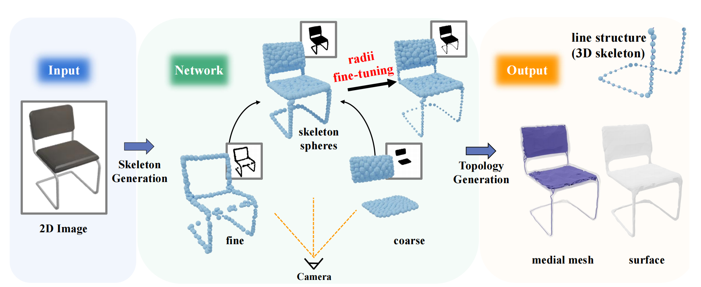

# S3DS: Self-supervised Learning of 3D Skeletons from Single View Images

Official implementation of " S3DS: Self-supervised Learning of 3D Skeletons from Single View Images".

[**Paper**](https://dl.acm.org/doi/abs/10.1145/3581783.3612204)

## Method Overview
<p align="center">
    
</p>


## Installation
```sh
conda create -n S3DS python=3.7.12

conda activate S3DS

pip install -r requirements.txt

pip install kaolin==0.12.0 -f https://nvidia-kaolin.s3.us-east-2.amazonaws.com/torch-1.11.0_cu113.html

cd pytorch3d

python setup.py install
```

## Datasets
Download the shapenet_img to S3DS/data/

https://drive.google.com/file/d/1wVElYRaKgYYWiBo5uMAlIGoROg9xqoP1/view?usp=sharing


Download checkpoint of resnet model to checkpoint/

https://drive.google.com/file/d/1lF81PqojD8bz0hsAtaJGBmPbWIo8xJD8/view?usp=sharing


Download checkpoint of S3DS model to data/results/models/03001627/

https://drive.google.com/file/d/1jR0OiyiWJk9V8TKZX-vpRK2np2MeTKeq/view?usp=sharing

## Training & Testing
```sh
cd S3DS
python examples/recon/train.py -eid 03001627 -config ./configs/default_03001627.yaml

python examples/recon/test.py -cls 03001627 -eid 03001627 -md ./data/results/models/03001627/checkpoint_finetune_0100000.pth.tar
```
